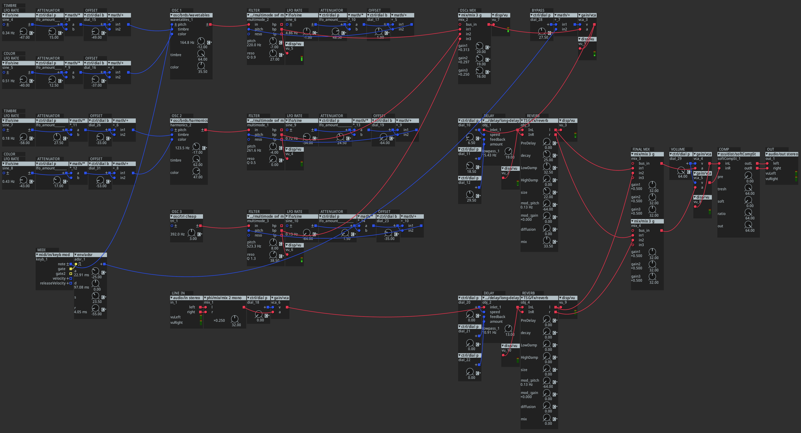

# MIDI Setup 🎛️

## Overview 🎯
Our goal is to control parameters of the Drone synthesizer, which runs on the Axoloti board, using the Evolution UC33e MIDI controller. Axoloti is a DIY-friendly digital audio environment for _“Sketching digital audio algorithms with the musical playability of standalone hardware.”_ It is open source and was created by the brilliant [Johannes Taelman](https://github.com/JohannesTaelman). [Here](https://www.youtube.com/watch?v=g9yBebl8-vk) the original presentation at the Chaos Computer Club ([CCC](https://www.youtube.com/@mediacccde)). The platform offers comprehensive sound design capabilities, which we can map to the UC33e's physical controls for more intuitive, hands-on manipulation. More info can be found [here](https://ksoloti.github.io/2-background.html).

 
*The Axoloti Core board*

## Patch Analysis 🔍
The Axoloti-based drone synthesizer consists of a custom patch created by [Guilherme Martins](https://www.guilhermemartins.net/) and adapted by me.  
The original patch is available on his personal GitHub [here](https://github.com/guibot/DRONE-ENGINE) and is free to use.

  
*A custom version of the Drone Engine patch by guibot (Guilherme Martins)*

### Parameter Sections:
The patch is primarily composed of:

* 3x Oscillators + ad‑hoc modulation and mixing stages
* Line input
* 2x Independent effects sections (one for the 3 oscillators, one for the line input) with reverb and delay
* Filter section for each oscillator
* MIDI input with ASR controlling the oscillators' pitch

## UC33e Mapping Configuration 🎹

The possible controls are nearly endless. For simplicity, I decided to divide the mapping into two pages (presets P22 and P23 on the UC33e):

- **P22:** Source + Modulation + Filter + Mix sections
- **P23:** Effects + LineIn + MIDI

  
*P22 preset*

  
*P23 preset*

## Resources 📚
- [1] [Axoloti article on CDM](https://cdm.link/axoloti-makes-any-music-hardware-you-can-imagine/)
- [2] [Axoloti presentation](https://www.youtube.com/watch?v=g9yBebl8-vk) [Video]
- [3] [Axoloti Factory Objects](https://www.privatepublic.de/public/factory-objectlist.html) [discontinued]
- [4] [Ksoloti (new Axoloti)](https://ksoloti.github.io/index.html) [the successor of the discontinued Axoloti core board]
- [5] [Ksoloti discussion on MW](https://www.modwiggler.com/forum/viewtopic.php?t=277847&start=810)
- [6] [Ksoloti Community](https://ksoloti.discourse.group/)
- [7] [Ksoloti Github Repo](https://github.com/ksoloti)
- [8] [Guilherme on Drone patch](https://www.youtube.com/watch?v=osG7fh6tiE8) [Video]
- [9] [Drone original patch](https://github.com/guibot/DRONE-ENGINE/commits?author=guibot)
- [10] [M-Audio Evolution UC33e Manual](https://www.strumentimusicali.net/manuali/M_AUDIO_UC-33e_EN.pdf)

## TODO List 📝
- Understand MSB and LSB parameters for higher resolution control
- Think about the addition of the play/pause/fwd buttons in the bottom right