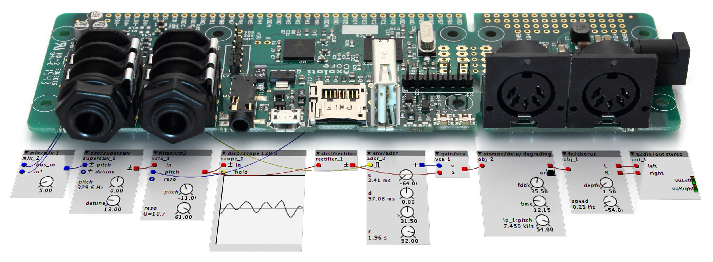
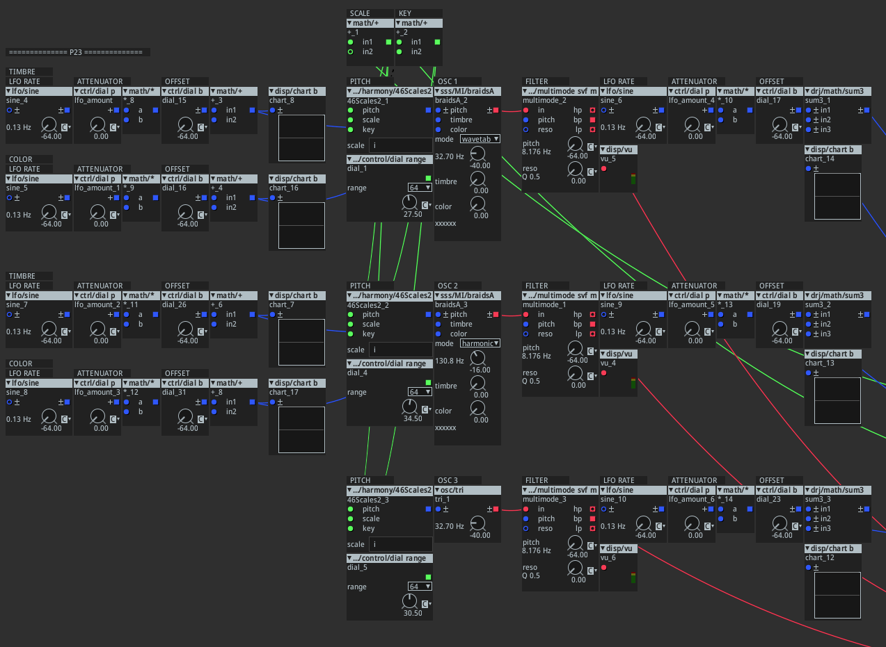
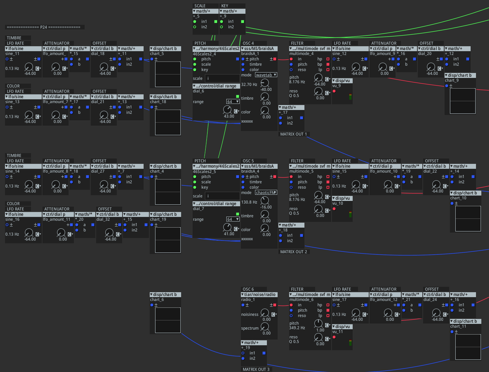
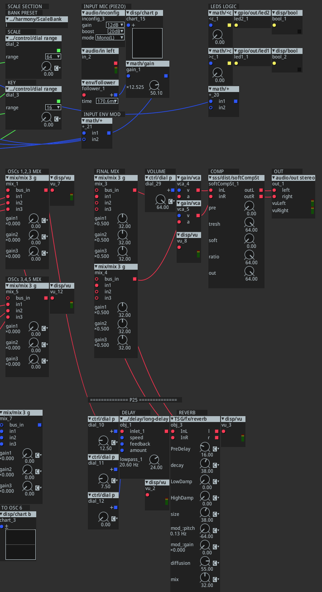
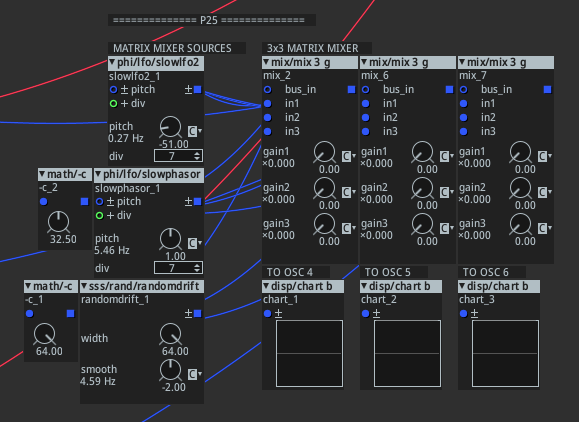
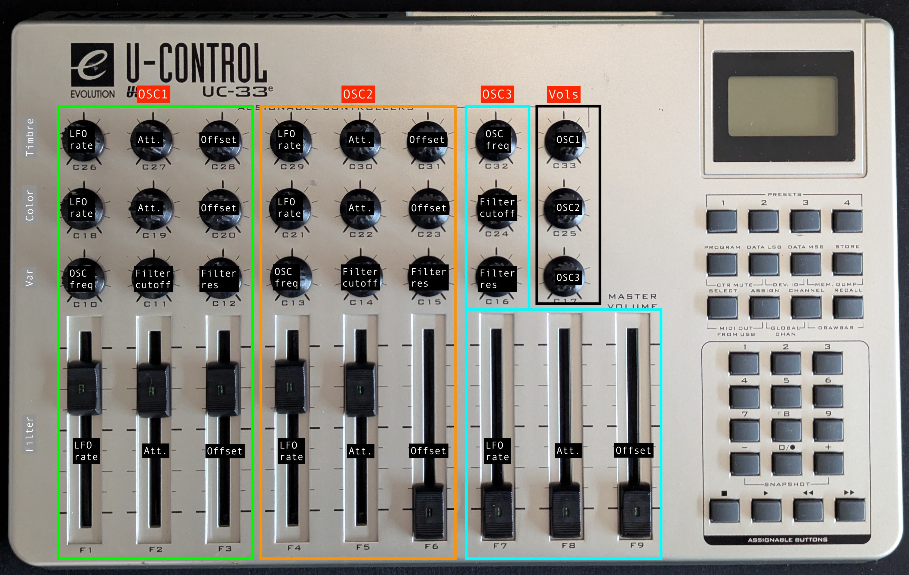
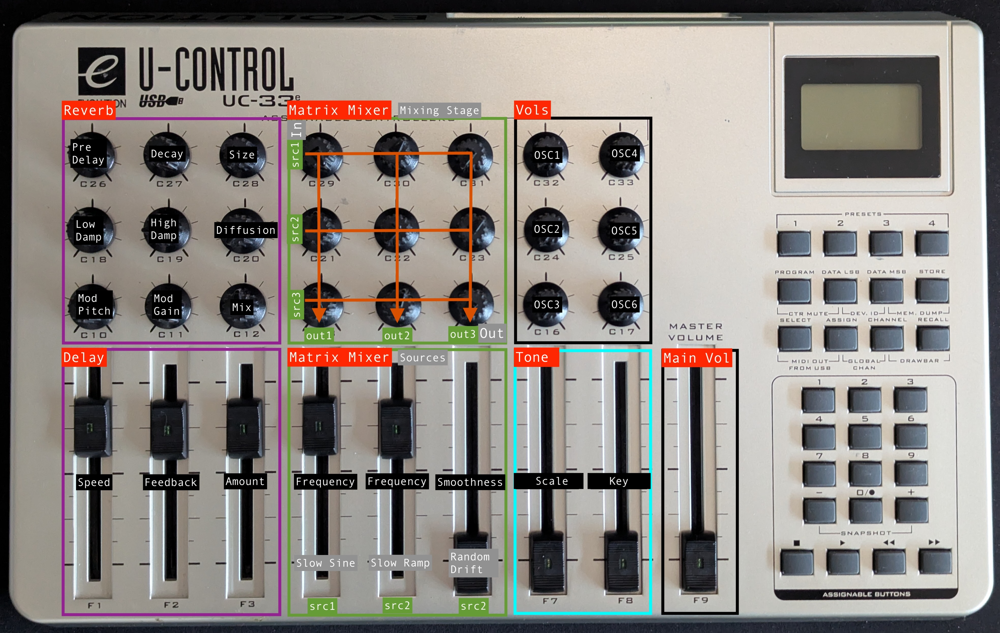
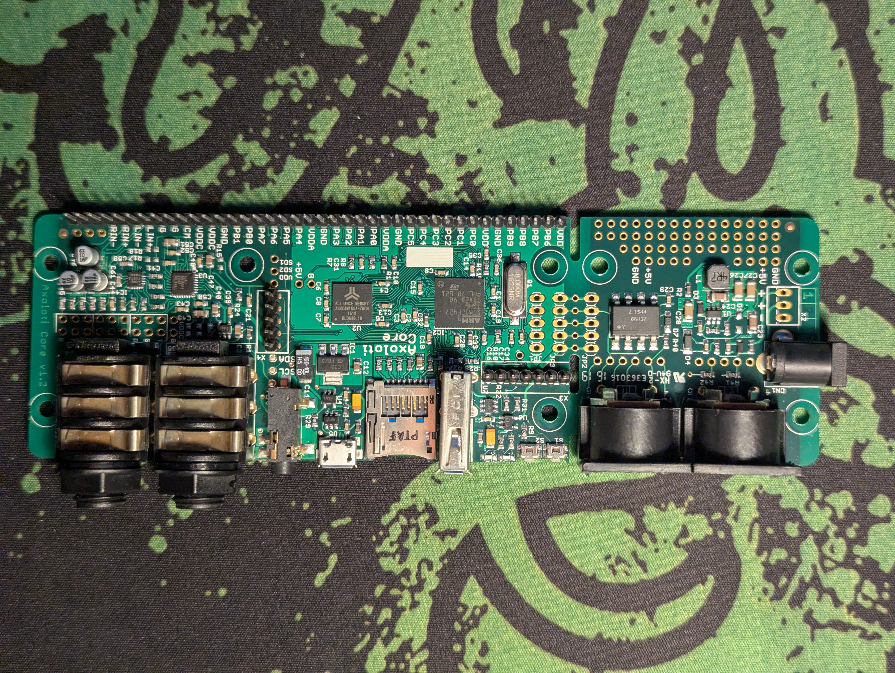
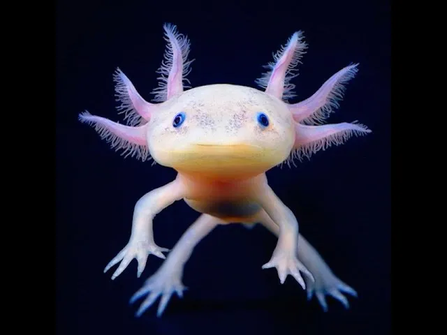

# AnDrone 🎛️ 

## Overview 🎯
The goal of this project is to control the AnDrone synthesizer's parameters, which runs on the Axoloti board, using the Evolution UC33e MIDI controller. Axoloti is a DIY-friendly digital audio environment for _“Sketching digital audio algorithms with the musical playability of standalone hardware.”_ It is open source and was created by the brilliant [Johannes Taelman](https://github.com/JohannesTaelman). [Here](https://www.youtube.com/watch?v=g9yBebl8-vk) is the original presentation at the Chaos Computer Club ([CCC](https://www.youtube.com/@mediacccde)). The platform offers comprehensive sound design capabilities, which can be mapped to the UC33e's physical controls for more intuitive, hands-on manipulation. More info can be found [here](https://ksoloti.github.io/2-background.html).

 
*The Axoloti Core board*

The AnDrone synthesizer was inspired by a patch from [Guilherme Martins](https://www.guilhermemartins.net/) ([original patch](https://github.com/guibot/DRONE-ENGINE)).

## Patch Analysis 🔍

*AnDrone patch - Oscillators 1, 2, 3 section*

*AnDrone patch - Oscillators 4, 5, 6 section*

*AnDrone patch - I/O Stage, FX and Scale/Key section*

*AnDrone patch - Matrix Mixer section*

### Parameter Sections
There are a few changes with respect to the V1:

- 6x oscillators + ad‑hoc modulation
- Filter section for each oscillator + ad‑hoc modulation
- Effects section with reverb and delay acting on the master
- 3x3 matrix mixer for more complex modulations
- Line input (used for modulation)

Oscillators 1, 2, 4, 5 use different synthesis models of the well known Mutable Instruments [Braids](https://pichenettes.github.io/mutable-instruments-documentation/modules/braids/) oscillator. The synthesis model can easily be changed from the Axoloti patcher.

### Matrix Mixer
Additional signals were added to expand the modulation capabilities of the AnDrone.
The patch uses a 3x3 matrix mixer with 3 different modulations as inputs, which can be combined together to build more complex modulation signals.
These modulations act on Osc 4, 5 and 6.
The flow of the mixer is best understood by looking at the image below (P25 preset) together with the patch above.

**Inputs**

| Signal | Description |
|--------|-------------|
| `src1` | Slow sine signal |
| `src2` | Slow ramp signal |
| `src3` | Random drift signal |

**Outputs**

| Signal | Destination |
|--------|-------------|
| `out1` | Summed with the `color` mod of OSC 4 |
| `out2` | Summed with the `color` mod of OSC 5 |
| `out3` | Modulates the `pitch` of OSC 6 on its own |

### Line Input
The line input serves as an additional, but temporary, modulation signal for the cutoff frequency of OSC 1, 2, 3. The signal is fed into an envelope follower, whose output drives the modulation.
The input is optimized for a piezoelectric microphone, but the gain stage can be adjusted directly on the patch.

### Scale and Key
There are 46 possible scales to select, along with the root key.
The `range` dial controls the pitch range of the oscillators, so it's an important parameter to get right.
Below is a list of the int value and the corresponding octave extension.

Pitch control range (semitones):

- 24 (2 octaves) — good for a tight lead/melody
- 48 (4 octaves) — good general-purpose range for most melodic uses
- 60-72 (5-6 octaves) — covers most of a piano's usable range
- 128 (~10.7 octaves) — full range, spans from sub-audible to beyond audible pitch, too wide for most practical melodic use

In Axoloti, pitch inputs are expressed in semitone units rather than volts: 1.0 unit corresponds to one semitone, so 12.0 units is one octave up (doubling the frequency), and -12.0 is one octave down. This value is summed with the oscillator's base frequency (set by the frequency knob), which acts as an offset. The final sounding frequency is therefore `base frequency + pitch input (in semitones)`.
These are some suggestions for setting the base frequency, considering that this will be summed with the pitch above.

Oscillator base frequency (knob):

- C1 ≈ 32.7 Hz — deep sub-bass
- C2 ≈ 65.4 Hz — bass
- C3 ≈ 130.8 Hz — bass / low melodic range
- C4 ≈ 261.6 Hz — "middle C", mid / melodic range
- C5 ≈ 523.3 Hz — lead / high range

The starting point base frequency (fixed) is:
- **C1** for OSC 1, 3, 4
- **C3** for OSC 2, 5

OSC 6 is noise, so this doesn't apply to it.

## UC33e Mapping Configuration 🎹

The possible controls are nearly endless. For simplicity, the mapping is divided into multiple pages (presets P23, P24 and P25 on the UC33e):

- **P23:** Source + Modulation + Filter + Mix sections for Osc 1, 2, 3
- **P24:** Source + Modulation + Filter + Mix sections for Osc 4, 5, 6
- **P25:** Effects + Matrix Mixer + Scale + Extra

| UC33e Presets | CC Range | Purpose |
|------|-----|-----|
| **P23** | 1 - 33  | Source/Modulation |
| **P24** | 67 - 99 | Source/Modulation |
| **P25** | 34 - 66 | Effects/Routing/Scale |

  
*P23 preset*

  
*P24 preset*

  
*P25 preset*

## Changelog 📋

| Version | Highlights |
|---------|------------|
| **v1.0.0** | Base config — 3 oscillators, with modulation on several oscillator and filter parameters, plus effects |
| **v1.1.0** | Added 3 more oscillators, with a modulation matrix for the newly added ones |
| **v2.0.0** | Added mic-input modulation of the cutoff on the first 3 oscillators' filters (optimized for piezo) |
| **v2.1.0** | Added key quantization — oscillators now follow a selectable scale |

## Resources 📚
- [1] [Axoloti article on CDM](https://cdm.link/axoloti-makes-any-music-hardware-you-can-imagine/)
- [2] [Axoloti presentation](https://www.youtube.com/watch?v=g9yBebl8-vk)
- [3] [Axoloti Factory Objects](https://www.privatepublic.de/public/factory-objectlist.html) [discontinued]
- [4] [Ksoloti (new Axoloti)](https://ksoloti.github.io/index.html) [the deserving successor of the discontinued Axoloti core board]
- [5] [Ksoloti discussion on MW](https://www.modwiggler.com/forum/viewtopic.php?t=277847&start=810)
- [6] [Ksoloti community](https://ksoloti.discourse.group/)
- [7] [Ksoloti Github repo](https://github.com/ksoloti)
- [8] [Guilherme on Drone patch](https://www.youtube.com/watch?v=osG7fh6tiE8) 
- [9] [Drone original patch](https://github.com/guibot/DRONE-ENGINE/commits?author=guibot)
- [10] [Peeps Music Box by s8jfou](https://www.s8jfou.com/synth.html) | [Video](https://www.youtube.com/watch?v=w7IrjJ7MmoY)
- [11] [M-Audio Evolution UC33e Manual](https://www.strumentimusicali.net/manuali/M_AUDIO_UC-33e_EN.pdf)

## TODO List 📝

**Control / MIDI**
- [ ] Understand MSB/LSB parameters to get higher-resolution control
- [ ] Add MIDI clock input to sync the LFOs
- [ ] Make use of the 2 unused selectors on the Axoloti board
- [ ] Consider adding play/pause/fwd buttons (bottom right) for burst-like modulation

**Sound Design**
- [ ] Add an LFO with multiple square waveforms
- [ ] Add crunch/saturation on the delay path
- [ ] Add a soft-clipping stage after the filter stage or the summing stage
- [ ] Improve the compressor control (more informative feedback, e.g. gain reduction metering)

**I/O**
- [ ] Add a second piezo on the R channel for more modulation sources

**UI / Feedback**
- [ ] LEDs are currently linked only to the first LFO signal — explore other uses

**Performance**
- [ ] Optimize CPU usage

## AxoLove ❤️
  
*The author's Axoloti Core board v1.2*

  
*The real Axolotl <3*