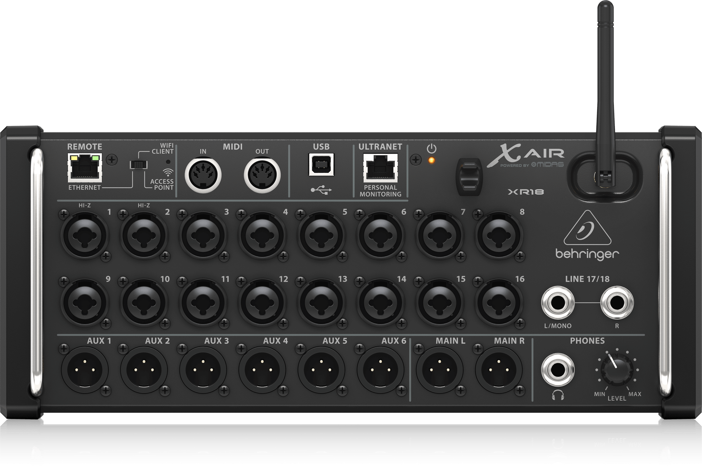
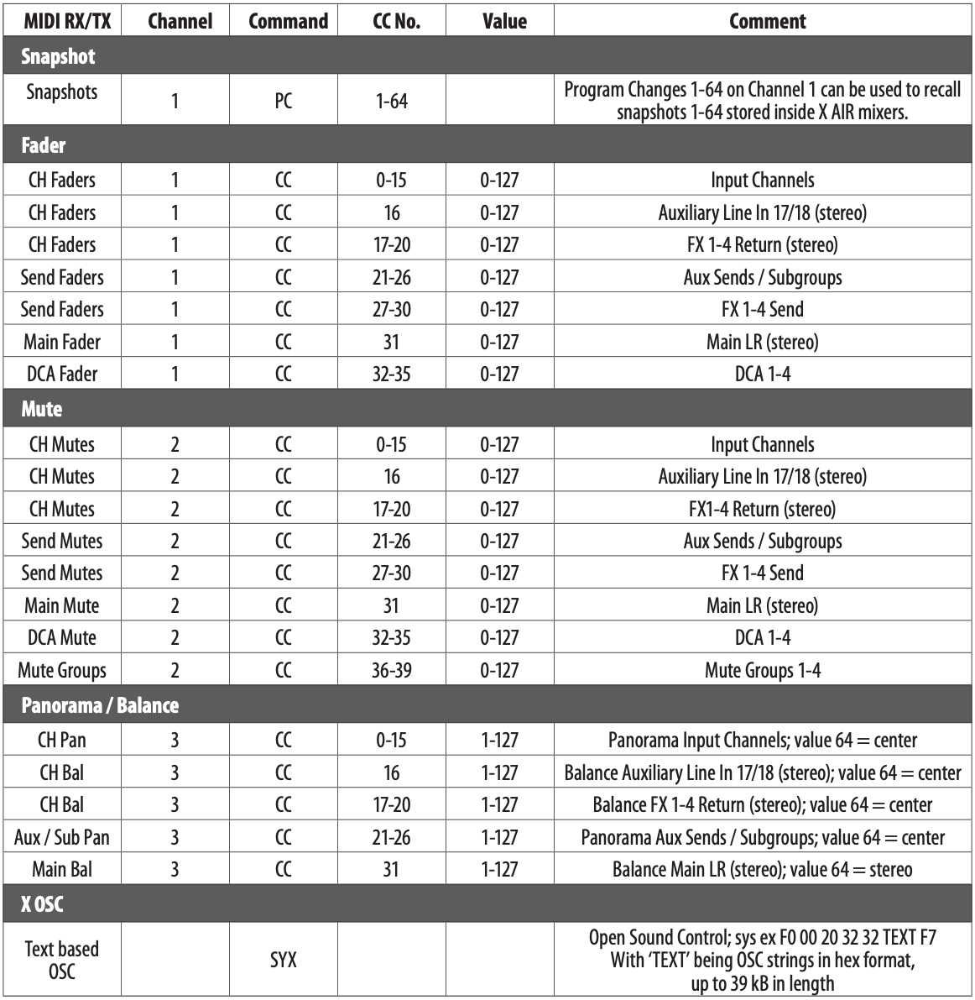
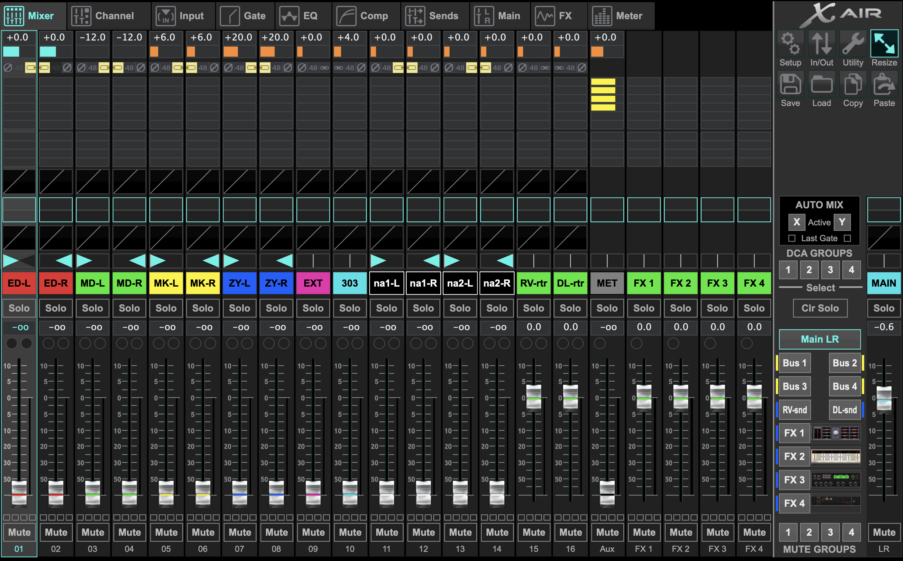
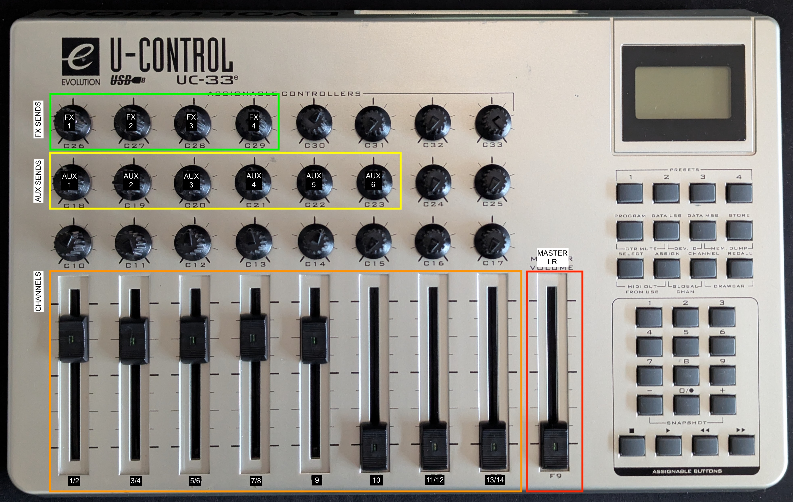

# MIDI Setup 🎛️

## Overview 🎯
Our goal is to control channels of the XR18 digital mixer using the Evolution UC33e MIDI controller. The XR18 is a great and complete digital mixer with tons of functionalities. Unfortunately, just few of them could be directly mapped via MIDI.

18-Channel, 12-Bus Digital Mixer with 16 Programmable Midas Preamps, Integrated WiFi Module and Multi-Channel USB Audio Interface. Some params could be controlled via app for MacOS/Windows/Linux/Android/iOS.
[Official App](https://play.google.com/store/apps/details?id=com.musictribe.mxmix) - MX-MIX - Tablet Only

[Unofficial App](https://play.google.com/store/search?q=mixing+station&c=apps) - Mixing Station

[Official App](https://play.google.com/store/apps/details?id=com.behringer.android.control.app.x32q) - Personal Monitoring only

*XR18 front panel*

## XR18 Control Analysis 🔍
Below the official MIDI implementation chart of the XR18.

*XR18 controllable parameters via MIDI CC*

The custom mixer studio setup is reported below (from X-Air app)): 

*XR18 X-Air app mixer configuration*

## UC33e Control Allocation 🎹
The table and figure below report the actual UC33e MIDI allocation with respect to the custom mixer studio setup.

| Channel     | Instrument    | CC | UC33e Fader |
|-------------|---------------|----|-------------|
| 1,2         | e-drum        | 0  | F1          |
| 3,4         | Machinedrum   | 2  | F2          |
| 5,6         | microKorg     | 4  | F3          |
| 7,8         | Zynthian      | 6  | F4          |
| 9           | Extra         | 8  | F5          |
| 10          | TD-3          | 9  | F6          |
| 11,12       | n.a.          | 10 | F7          |
| 13,14       | n.a.          | 12 | F8          |
| 15          | ext. FX1 ret. | 14 | n.a.        |
| 16          | ext. FX2 ret. | 15 | n.a.        |
| Aux (17,18) | Metronome     | 16 | n.a.        |
| Master L,R  | Main Stereo   | 31 | F9          |

*UC33e XR18 mapping*

## Resources 📚
- [1] [XR18 Manual](https://www.sweetwater.com/sweetcare/articles/behringer-x-air-manual-x18-xr18-xr16-xr12/)
- [3] [M-Audio Evolution UC33e Manual](https://www.strumentimusicali.net/manuali/M_AUDIO_UC-33e_EN.pdf)

## TODO List 📝
- Check if Mixing Station app could be used to control also bus/aux sends