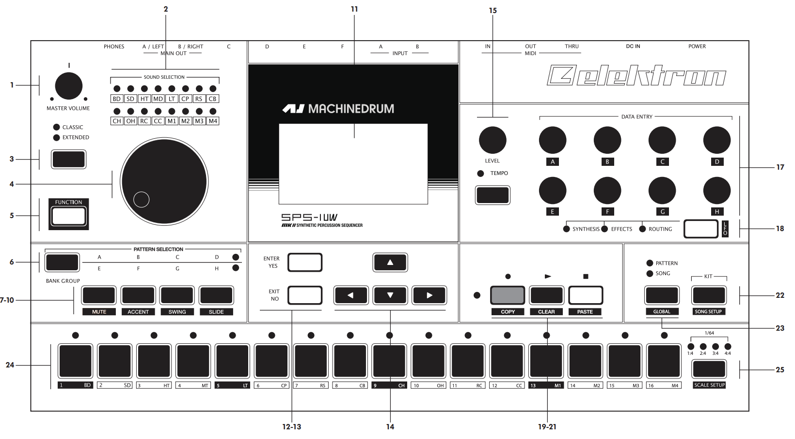
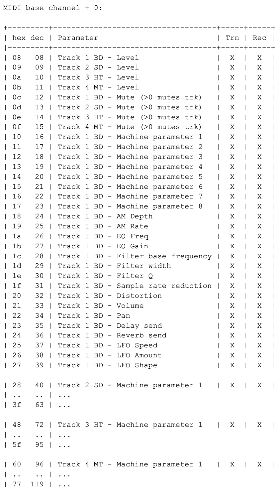
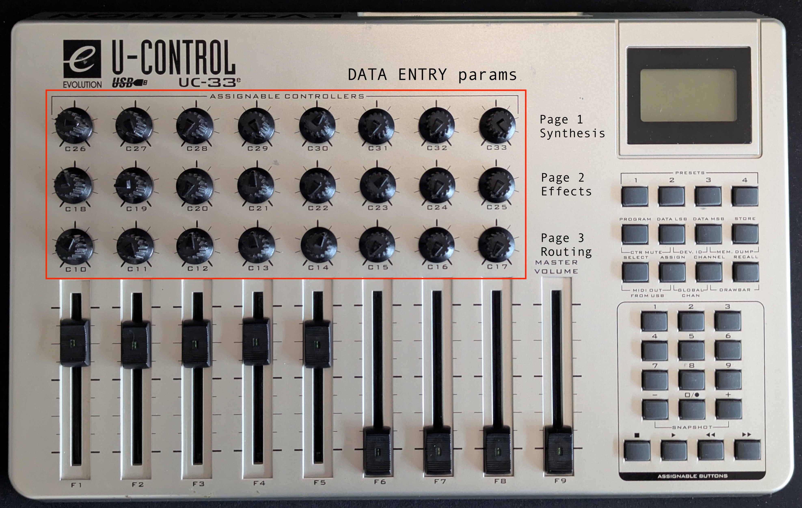
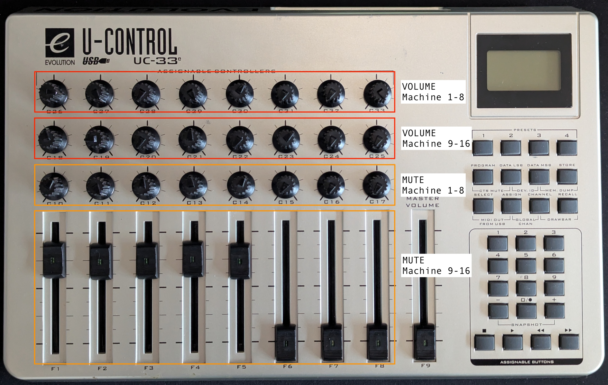
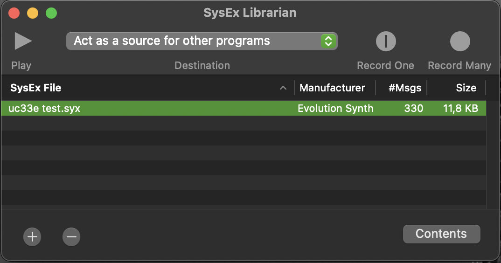

# Elektron Machinedrum - Evolution UC33e 
# MIDI Setup 🎛️

## Overview 🎯
Our goal is to control some parameters of the Elektron Machinedrum (MD). 
Specifically, we focus on the **DATA ENTRY** knobs (synthesis, effects, routings) used for tweaking machine parameters, plus the **LEVEL** (volume) knob of each machine [1].

For each of the 16 machines we have 24 different DATA ENTRY knobs:

* 🎛️ 8 for Synthesis - 1st MD page
* 🔥 8 for Effects - 2nd MD page  
* 🔗 8 for Routing - 3rd MD page
* 🔊 16 LEVEL knobs, one for each machine

For this configuration, we suggest using a **Control Base Channel** = 1-4, which can be selected in the GLOBAL configuration of the MD.

The CTRL-CHANGE mappings follow these rules [1]:

## MIDI Channel Mapping 📡

**MIDI CHANNEL 1** — Controls machines 1, 2, 3, 4:

- **Machine 1**: 
  - LEVEL knob: 8
  - MUTE button: 12
  - DATA ENTRY knobs: 16 → 39
- **Machine 2**: 
  - LEVEL knob: 9
  - MUTE button: 13
  - DATA ENTRY knobs: 40 → 63
- **Machine 3**: 
  - LEVEL knob: 10
  - MUTE button: 14
  - DATA ENTRY knobs: 72 → 95
- **Machine 4**: 
  - LEVEL knob: 11
  - MUTE button: 15
  - DATA ENTRY knobs: 96 → 119

**MIDI CHANNEL 2** — Controls machines 5, 6, 7, 8  
**MIDI CHANNEL 3** — Controls machines 9, 10, 11, 12  
**MIDI CHANNEL 4** — Controls machines 13, 14, 15, 16  

**💡 Note**: Only the MIDI CHANNEL changes - the CC values remain consistent across channels!

## Controller Layout 🎹
Due to this parameter configuration, we can divide the UC33e as follows:

You can see that each MD page of the DATA ENTRY section fits perfectly in a single row of the UC33e. In other words, the 3 pages of the MD can be entirely mapped to the 3 rows of the UC33e. 

Since the UC33e can store multiple presets (up to 33), we can assign **1 UC33e preset for each MD machine**. This way, by recalling/loading each preset, we can edit a single machine on our MD.

We end up with **16 different presets**, from P01 to P16.

**➕ Additionally**, we create preset P17 where we map all LEVEL knobs and MUTE buttons for all 16 machines.

### Fader Assignment:
- MD machines 1-8 VOLUME → Presets P01 to P08
- MD machines 9-16 VOLUME → Presets P09 to P16

## Mapping Procedure 🔄
For each parameter, we need to perform 2 main operations on the UC33e: **Assignment** and **Storage**.

I suggest performing the Assignment operation for **all** DATA ENTRY controls referring to a single MD machine, then storing the mapping to a single UC33e preset. 

### 1. Assignment:  
- Move the desired knob/fader/button 
- Press **ASSIGN**: Set the desired CC value for the MD (check CTRL-CHANGE MAPPINGS image) using the keypad
- Press **CHANNEL**: Set the desired MIDI Channel for the target MD machine

### 2. Storage: 
- Press **STORE**: Set the desired preset number where you want to save this mapping
- We choose to use P01 for MD machine 1, P02 for machine 2, and so on

**⚠️ Important**: Wait until the screen stops blinking before proceeding!

## Useful Tips & Tricks 💡
**Speed Up MIDI CHANNEL Assignment**:
- Press CHANNEL button and quickly move each knob/fader one after another
- Use + and - buttons to adjust the value shown on screen
- UC33e remains in MIDI CHANNEL assignment mode during this process

**Speed Up DATA ENTRY Assignment**:
- Press ASSIGN and quickly move each knob one after another  
- Enter the correct CC numbers on the keypad as you go

**Double-Check Assignments**:
- Quickly move knobs while watching the screen to verify CC and MIDI CHANNEL values

*"You have to be fast, bastard capitalist!!"* ⚡

## Workflow 🔄
As mentioned, we assign preset numbers (e.g., P03) to correspond with MD machines (e.g., machine 3, or *Track 3* in the manual[1]). Each UC33e preset stores mapping information for a single MD machine.

- **Load a Preset**: Press RECALL and enter the desired number (e.g., 3 for P03)
- **TBD** - Additional workflow steps to be defined

**⚠️ Important**: Wait until the controller's screen finishes blinking before using the controls!

## Memory Dump/Restore 💾
We use [SysEx Librarian](https://www.snoize.com/SysExLibrarian/) software with a MIDI2USB cable for I/O communication.

### Dump Process:
- Connect MIDI2USB to UC33e OUTPUT MIDI port
- In SysEx Librarian, select correct input source
- Press *Record Many* in SysEx Librarian
- On UC33e, press MEM.DUMP (DATA MSB + STORE)
- UC33e screen shows *SYS* - transmission in progress

### Restore Process:
- Connect MIDI2USB to UC33e INPUT MIDI port  
- In SysEx Librarian, select correct output source
- Select SysEx file and press *Play*
- UC33e screen shows *SYS* - receiving in progress

## Useful Shortcuts 🎯
- **Reset UC33e**: Turn on while holding + and - buttons
- **Lock UC33e**: Press CTR MUTE (PROGRAM + DATA LSB)  
- **Send Snapshots**: Press SNAPSHOT ("+" + "-")

## Resources 📚
[[1](https://www.strumentimusicali.net/manuali/ELEKTRON_SP1_ENG.pdf)] ELEKTRON Machinedrum Manual  
[[2](https://www.strumentimusicali.net/manuali/M_AUDIO_UC-33e_EN.pdf)] M-Audio Evolution UC33e Manual

## TODO List 📝
- Understand how to change predefined presets (1-4 upper right buttons)
- Understand MSB and LSB parameters (max MD resolution 32 bit)  
- Understand the PROGRAM parameter
- Understand the SELECT parameter