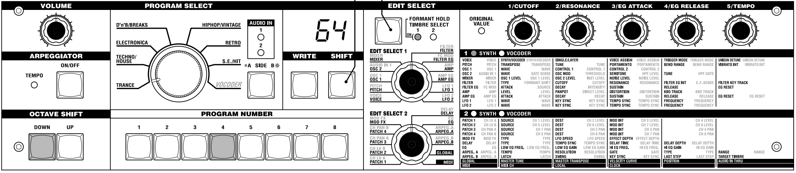
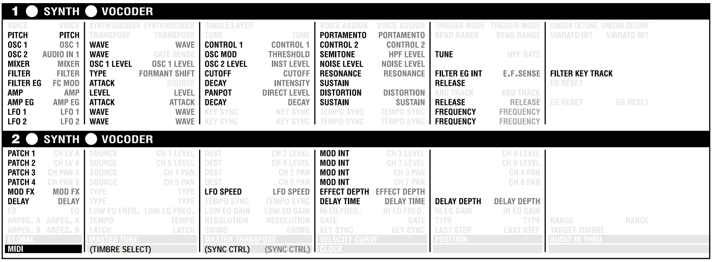
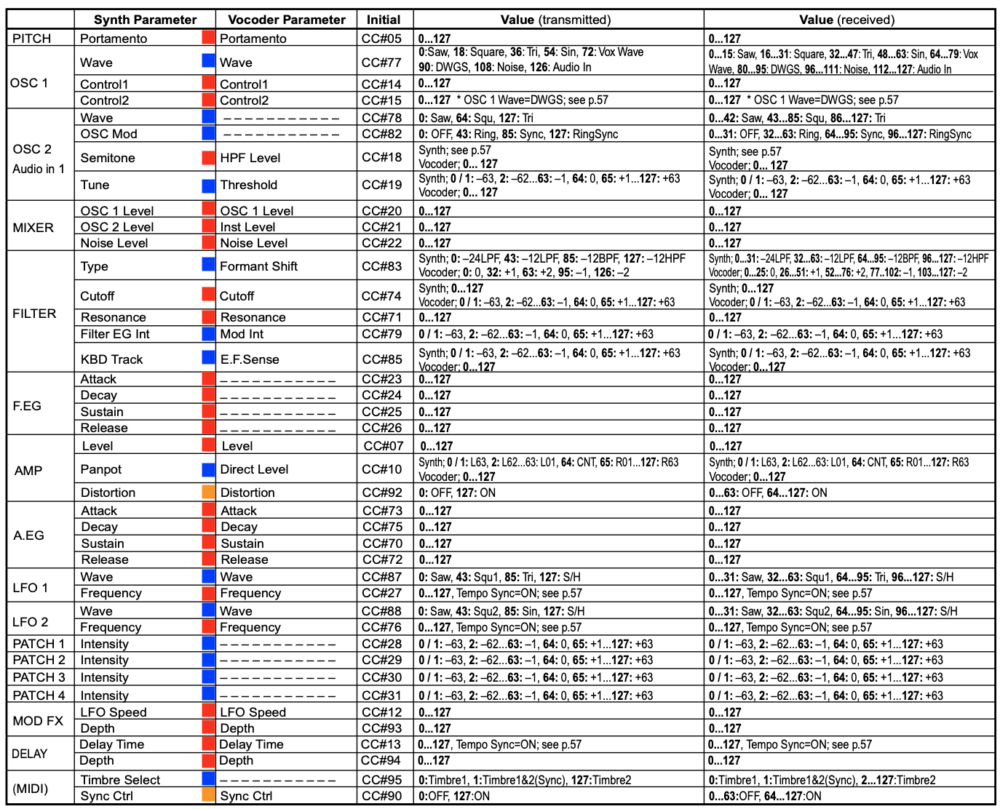
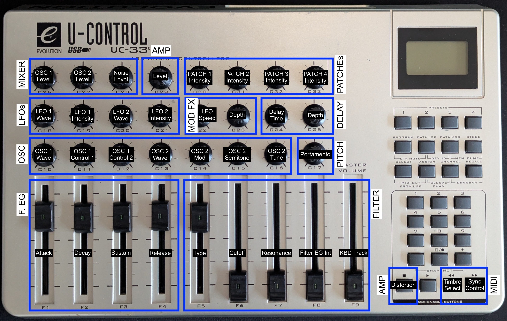
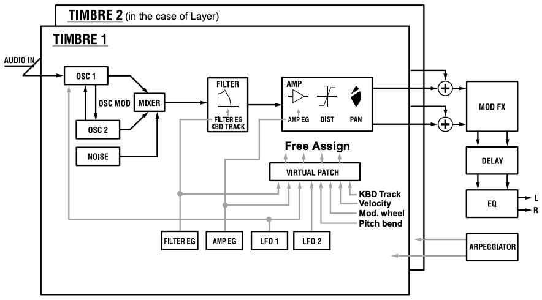

# Evolution UC33e - microKORG MIDI Setup 🎛️

## Overview 🎯
Our goal is to control parameters of the microKORG synthesizer using the Evolution UC33e MIDI controller. The microKORG offers comprehensive sound design capabilities that we can map to the UC33e's physical controls for more intuitive and hands-on manipulation.

*microKORG front panel*

## microKORG Control Analysis 🔍

*microKORG controllable parameters via MIDI CC*

### Parameter Sections:
- **OSC + PITCH**: 8 parameters
- **MIXER**: 3 parameters
- **FILTER + EG**: 9 parameters
- **AMP + EG**: 7 parameters
- **LFOs**: 4 parameters
- **PATCHES**: 4 parameters
- **MOD FX + DELAY**: 4 parameters
- **MIDI**: 2 parameters

**TOTAL**: 41 parameters

### Parameter Types:
- **🟠 SWITCH**: 2 controls [on/off]
- **🔴 POTENTIOMETERS**: 24 controls [0-127]
- **🔵 SELECTORS**: 15 controls [categorical]

*Complete MIDI CC mapping chart for microKORG*

## UC33e Control Allocation 🎹

### Available Controls:
- **KNOBS**: 24 controls
- **FADERS**: 9 controls
- **BUTTONS**: 4 controls (using only last row of keypad)

**TOTAL**: 37 controls

### Mapping Strategy:
We divided the UC33e into these macro sections:

*UC33e section layout for microKORG control*

**UC33e Section Layout:**

- **MIXER**: OSC levels and noise control
- **AMP**: Amplifier controls
- **PATCH**: Modulation patch controls (1-4 intensity)
- **LFOs**: Low Frequency Oscillators
- **MOD FX**: Effects modulation
- **DELAY**: Delay settings
- **OSC**: Oscillator controls and pitch
- **PITCH**: Pitch control
- **F.EG**: ADSR envelope for filter
- **FILTER**: Filter settings
- **MIDI**: MIDI settings

**Selected for Mapping:**

- **OSC + PITCH**: 8 knobs
- **MIXER**: 3 knobs
- **FILTER + EG**: 9 faders
- **AMP**: 2 buttons
- **LFOs**: 4 knobs
- **PATCHES**: 4 knobs
- **MOD FX + DELAY**: 4 knobs
- **MIDI**: 2 knobs

**TOTAL MAPPED**: 36 controls

## MIDI Channel Mapping 📡

The microKORG uses MIDI Channel 1 by default. I decided to use **MIDI Channel 5** since channels 1-4 are assigned for my Elektron Machinedrum.

To change the MIDI channel on the microKORG:

1. Turn the **EDIT SELECT 2** knob to the MIDI menu
2. Turn the **EDIT CONTROL 1** knob (CUTOFF) to select the desired MIDI Channel (MIDI CH)

## Mapping Process 🔄

For each parameter, perform these 2 main operations on the UC33e: **Assignment** and **Storage**.

### 1. Assignment:
- Move the desired knob/fader/button
- Press **ASSIGN**: Set the desired CC value for microKORG using the keypad
- Press **CHANNEL**: Set to **MIDI Channel 5** (or your preferred channel)

### 2. Storage:
- Press **STORE**: Set the desired preset number to save this mapping
- I use **P20** for the main microKORG mapping (others are for Elektron Machinedrum)

**⚠️ Important**: Wait until the screen stops blinking before proceeding!

## Useful Tips & Tricks 💡

**Speed Up MIDI CHANNEL Assignment:**

- Press CHANNEL button and quickly move each knob/fader one after another
- Use + and - buttons to adjust the value shown on screen
- UC33e remains in MIDI CHANNEL assignment mode during this process

**Speed Up CC Assignment:**

- Press ASSIGN and quickly move each knob one after another
- Enter the correct CC numbers on the keypad as you go

**Double-Check Assignments:**

- Quickly move knobs while watching the screen to verify CC and MIDI CHANNEL values

## Workflow 🔄

Each UC33e preset stores a complete mapping for microKORG control. The layout follows the natural signal flow of the synthesizer:

- **Load a Preset**: Press RECALL and enter the preset number (e.g., 20 for P20)
- **Sound Creation**: Start with OSC section, move through MIXER, FILTER, then AMP
- **Modulation**: Use LFO and PATCH sections for dynamic control
- **Effects**: Apply MOD FX and DELAY for spatial enhancement

*microKORG synthesizer block diagram*

## Memory Dump/Restore 💾

Use [SysEx Librarian](https://www.snoize.com/SysExLibrarian/) software with a MIDI2USB cable for I/O communication. You can also send MIDI via USB by using the **MIDI OUT FROM USB** function (press SELECT + ASSIGN together).

### Dump Process:
- Connect MIDI2USB to UC33e OUTPUT MIDI port
- In SysEx Librarian, select correct input source
- Press *Record Many* in SysEx Librarian
- On UC33e, press MEM.DUMP (DATA MSB + STORE)
- UC33e screen shows *SYS* - transmission in progress

### Restore Process:
- Connect MIDI2USB to UC33e INPUT MIDI port
- In SysEx Librarian, select correct output source
- Select SysEx file and press *Play*
- UC33e screen shows *SYS* - receiving in progress

## Useful Shortcuts 🎯
- **Reset UC33e**: Turn on while holding + and - buttons
- **Lock UC33e**: Press CTR MUTE (PROGRAM + DATA LSB)
- **Send Snapshots**: Press SNAPSHOT ("+" + "-")
- **MIDI Out via USB**: Press SELECT + ASSIGN together

## Resources 📚
- [1] [microKORG Manual](https://cdn.korg.com/us/support/download/files/8f226053113b3be59753dcce14e74cca.pdf) - *I love this manual!*
- [2] [microKORG Quick Start](https://archive.org/details/synthmanual-korg-micro-korg-quick-start-guide)
- [3] [M-Audio Evolution UC33e Manual](https://www.strumentimusicali.net/manuali/M_AUDIO_UC-33e_EN.pdf)

## TODO List 📝
- Understand MSB and LSB parameters for higher resolution control
- Understand the PROGRAM parameter for patch management
- Understand the SELECT parameter for timbre selection