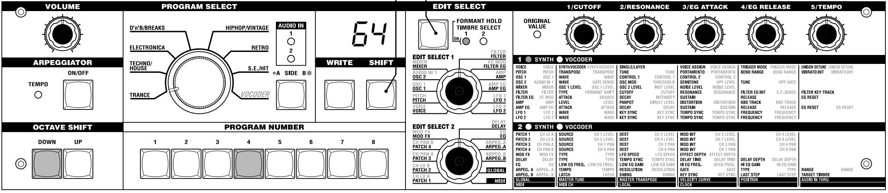
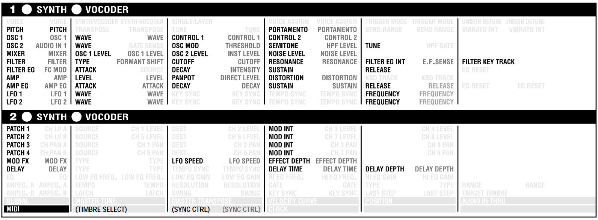
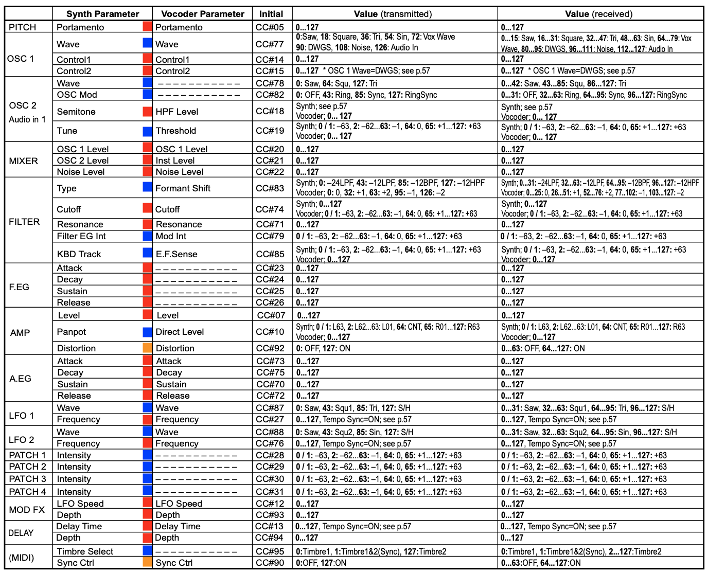
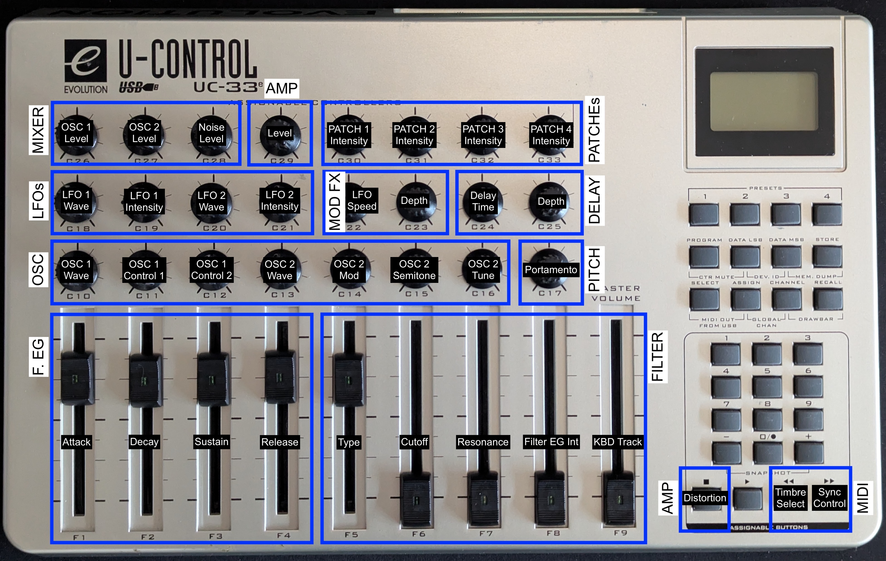
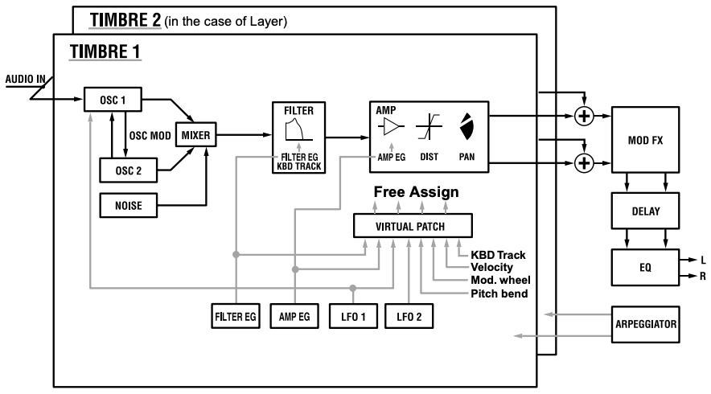

#MIDI Setup 🎛️

## Overview 🎯
Our goal is to control parameters of the microKORG synthesizer using the Evolution UC33e MIDI controller. The microKORG offers comprehensive sound design capabilities that we can map to the UC33e's physical controls for more intuitive and hands-on manipulation.

*microKORG front panel*

## microKORG Control Analysis 🔍

*microKORG controllable parameters via MIDI CC*

### Parameter Sections:
- **OSC + PITCH**: 8 parameters
- **MIXER**: 3 parameters
- **FILTER + EG**: 9 parameters
- **AMP + EG**: 7 parameters
- **LFOs**: 4 parameters
- **PATCHES**: 4 parameters
- **MOD FX + DELAY**: 4 parameters
- **MIDI**: 2 parameters

**TOTAL**: 41 parameters

### Parameter Types:
- **🟠 SWITCH**: 2 controls [on/off]
- **🔴 POTENTIOMETERS**: 24 controls [0-127]
- **🔵 SELECTORS**: 15 controls [categorical]

*Complete MIDI CC mapping chart for microKORG*

## UC33e Control Allocation 🎹

### Available Controls:
- **KNOBS**: 24 controls
- **FADERS**: 9 controls
- **BUTTONS**: 4 controls (using only last row of keypad)

**TOTAL**: 37 controls

### Mapping Strategy:
We divided the UC33e into these macro sections:

*UC33e section layout for microKORG control*

**UC33e Section Layout:**

- **MIXER**: OSC levels and noise control
- **AMP**: Amplifier controls
- **PATCH**: Modulation patch controls (1-4 intensity)
- **LFOs**: Low Frequency Oscillators
- **MOD FX**: Effects modulation
- **DELAY**: Delay settings
- **OSC**: Oscillator controls and pitch
- **PITCH**: Pitch control
- **F.EG**: ADSR envelope for filter
- **FILTER**: Filter settings
- **MIDI**: MIDI settings

**Selected for Mapping:**

- **OSC + PITCH**: 8 knobs
- **MIXER**: 3 knobs
- **FILTER + EG**: 9 faders
- **AMP**: 2 buttons
- **LFOs**: 4 knobs
- **PATCHES**: 4 knobs
- **MOD FX + DELAY**: 4 knobs
- **MIDI**: 2 knobs

**TOTAL MAPPED**: 36 controls

## MIDI Channel Mapping 📡

The microKORG uses MIDI Channel 1 by default. I decided to use **MIDI Channel 5** since channels 1-4 are assigned for my Elektron Machinedrum.

To change the MIDI channel on the microKORG:

1. Turn the **EDIT SELECT 2** knob to the MIDI menu
2. Turn the **EDIT CONTROL 1** knob (CUTOFF) to select the desired MIDI Channel (MIDI CH)

## Workflow 🔄

Each UC33e preset stores a complete mapping for microKORG control. The layout follows the natural signal flow of the synthesizer:

- **Load a Preset**: Press RECALL and enter the preset number (e.g., 20 for P20)
- **Sound Creation**: Start with OSC section, move through MIXER, FILTER, then AMP
- **Modulation**: Use LFO and PATCH sections for dynamic control
- **Effects**: Apply MOD FX and DELAY for spatial enhancement

*microKORG synthesizer block diagram*

## Resources 📚
- [1] [microKORG Manual](https://cdn.korg.com/us/support/download/files/8f226053113b3be59753dcce14e74cca.pdf) - *I love this manual!*
- [2] [microKORG Quick Start](https://archive.org/details/synthmanual-korg-micro-korg-quick-start-guide)
- [3] [M-Audio Evolution UC33e Manual](https://www.strumentimusicali.net/manuali/M_AUDIO_UC-33e_EN.pdf)

## TODO List 📝
- Understand MSB and LSB parameters for higher resolution control
- Understand the PROGRAM parameter for patch management
- Understand the SELECT parameter for timbre selection